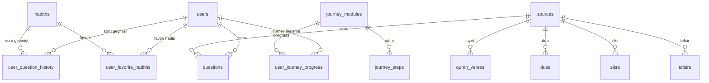

# DATABASE.md (prompt/ klasörü)

> **Not:** Bu dosya, context engine ve LLM tabanlı araçlar için projenin veritabanı (SQL) yapısının merkezi ve tekil kaynağıdır. Tüm ana tablolar, alanlar, ilişkiler, migration ve seed akışı, önemli SQL scriptleri ve veri modeli referansları burada tutulur. Diğer md dosyaları için referans noktasıdır. Yeni tablo veya değişiklik geldikçe burası güncellenmelidir.

---

# Veritabanı (SQL) Yapısı ve Akışları

## 1. Ana Tablolar ve Alanlar (Güncel)

### users
- id (PK, int)
- username (str, unique, required)
- email (str, unique, required)
- hashed_password (str, required)
- is_admin (bool, default: False)
- is_premium (bool, default: False)
- premium_expiry (datetime, nullable)
- İlişkiler: questions, question_history, favorite_hadiths, user_journey_progress

### sources
- id (PK, int)
- type (str, index)  // quran, hadis, kitap, vs.
- name (str, index)
- reference (str)
- İlişkiler: questions, quran_verses, duas, zikrs, tafsirs

### questions
- id (PK, int)
- text (Text, required)
- answer (Text)
- user_id (FK: users.id)
- source_id (FK: sources.id)
- İlişkiler: user, source

### journey_modules
- id (PK, int)
- title (str, required)
- description (Text)
- icon (str)
- category (str)
- tags (str)
- İlişkiler: steps (JourneyStep), user_journey_progress

### journey_steps
- id (PK, int)
- module_id (FK: journey_modules.id, required)
- title (str, required)
- order (int, required)
- content (Text)
- media_url (Text)
- media_type (str) // image, video, link
- source (str)
- İlişkiler: module (JourneyModule)

### user_journey_progress
- id (PK, int)
- user_id (FK: users.id, required)
- module_id (FK: journey_modules.id, required)
- completed_step (int, default: 0)
- completed_at (datetime, nullable)

### hadiths
- id (PK, int)
- text (Text, required)
- source (str, required)
- reference (str)
- category (str)
- language (str, default: 'tr')
- embedding (Text, nullable)
- İlişkiler: user_favorite_hadiths, user_question_history

### user_question_history
- id (PK, int)
- user_id (FK: users.id, required)
- question (str, required)
- answer (Text)
- hadith_id (FK: hadiths.id, nullable)
- created_at (datetime, default: now)
- İlişkiler: user

### user_favorite_hadiths
- id (PK, int)
- user_id (FK: users.id, required)
- hadith_id (FK: hadiths.id, required)
- created_at (datetime, default: now)
- İlişkiler: user, hadith

### settings
- id (PK, int)
- key (str, unique, required)
- value (str, required)
- Unique: key

### quran_verses
- id (PK, int)
- surah (str, required)
- ayah (int, required)
- text (Text, required)
- translation (Text)
- source_id (FK: sources.id, nullable)
- language (str, default: 'tr')
- Unique: (surah, ayah, language)

### duas
- id (PK, int)
- title (str, required)
- text (Text, required)
- translation (Text)
- category (str)
- source_id (FK: sources.id, nullable)
- language (str, default: 'tr')

### zikrs
- id (PK, int)
- title (str, required)
- text (Text, required)
- translation (Text)
- count (int)
- category (str)
- source_id (FK: sources.id, nullable)
- language (str, default: 'tr')

### tafsirs
- id (PK, int)
- surah (str, required)
- ayah (int, required)
- text (Text, required)
- author (str)
- source_id (FK: sources.id, nullable)
- language (str, default: 'tr')
- Unique: (surah, ayah, author, language)

### alembic_version
- version_num (str, PK) // Alembic migration yönetimi için

---

## 2. Tablolar Arası İlişkiler ve Unique Constraint'ler
- users <-> questions (One-to-Many)
- users <-> user_question_history (One-to-Many)
- users <-> user_favorite_hadiths (One-to-Many)
- users <-> user_journey_progress (One-to-Many)
- hadiths <-> user_favorite_hadiths (One-to-Many)
- hadiths <-> user_question_history (One-to-Many)
- journey_modules <-> journey_steps (One-to-Many)
- journey_modules <-> user_journey_progress (One-to-Many)
- sources <-> questions/quran_verses/duas/zikrs/tafsirs (One-to-Many)
- quran_verses: Unique (surah, ayah, language)
- tafsirs: Unique (surah, ayah, author, language)
- settings: Unique (key)

---

## 3. Migration ve Seed Akışı
- **Migration:** Alembic veya manuel SQL scriptleri ile
- **Seed/Örnek Veri:** hadith_loader.py, add_sample_data.py ile CSV/JSON üzerinden
- **Örnek Komutlar:**
  - Migration başlat: `alembic revision --autogenerate -m "..."`
  - Migration uygula: `alembic upgrade head`
  - Toplu veri yükle: `python hadith_loader.py hadith_big_example.csv`
  - Embedding güncelle: `python embedding_utils.py`
- [Detay: backend klasörü ve scriptler]

---

## 4. Önemli SQL Scriptleri
- `drop_all.sql`: Tüm tabloları sıfırlamak için kullanılır (geliştirme ortamında dikkatli kullanılmalı)
- Diğer migration ve seed scriptleri backend/ klasöründe tutulur

---

## 5. Best Practice ve Yasaklar
- Migration ve seed işlemleri sadece backend scriptleri veya migration aracı ile yapılmalı, manuel müdahaleden kaçınılmalı
- Canlı veritabanında doğrudan tablo/sütun silme işlemi yapılmamalı
- Tüm veri modeli değişiklikleri backend/models.py ve bu dosyada güncellenmeli
- Hassas veri (şifre, token) asla düz metin olarak saklanmamalı
- [bkz: prompt/CONTEXT_OVERVIEW.md > Ortak Kurallar]

---

## 6. Veri Modeli Diyagramı (Özet)

---

> **Not:** Veritabanı yapısı ve veri modelleri ile ilgili detaylar için [bkz: prompt/PROJECT_STRUCTURE.md > Backend] ve [backend/models.py]. Diğer md dosyalarında tekrar veya bağlam kaybı tespit edilirse, bu dosyaya referans verilerek sadeleştirilmelidir. 
 